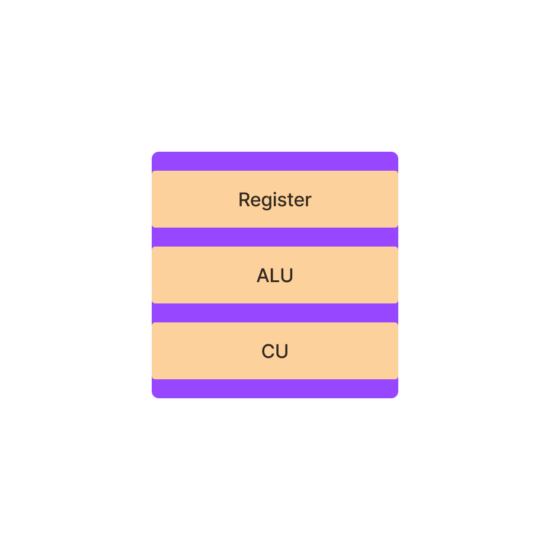
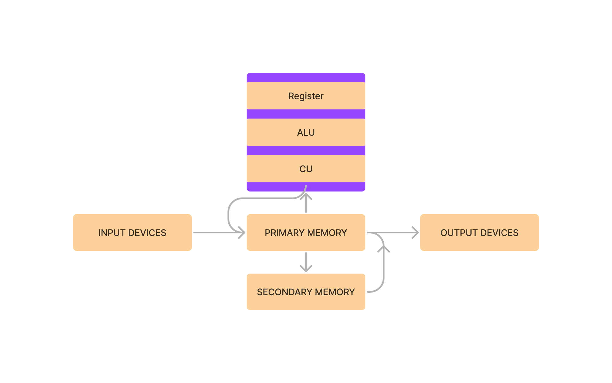
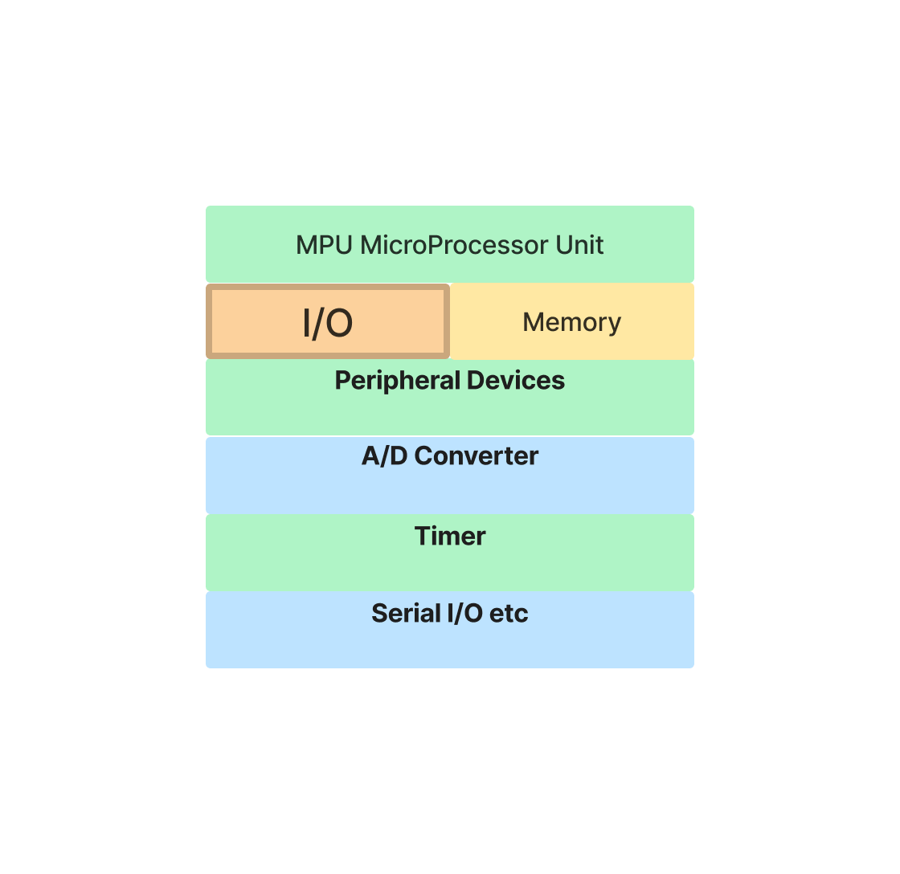
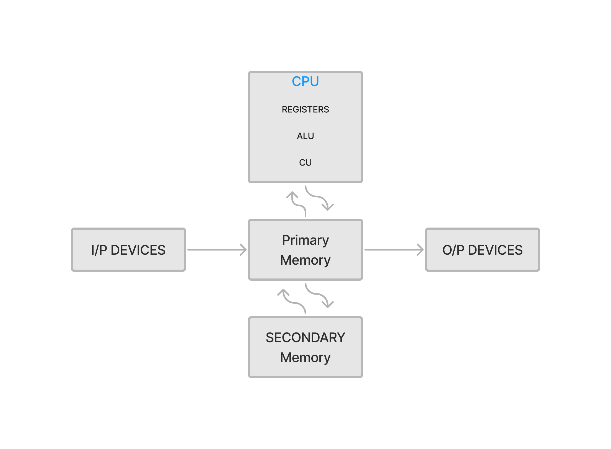
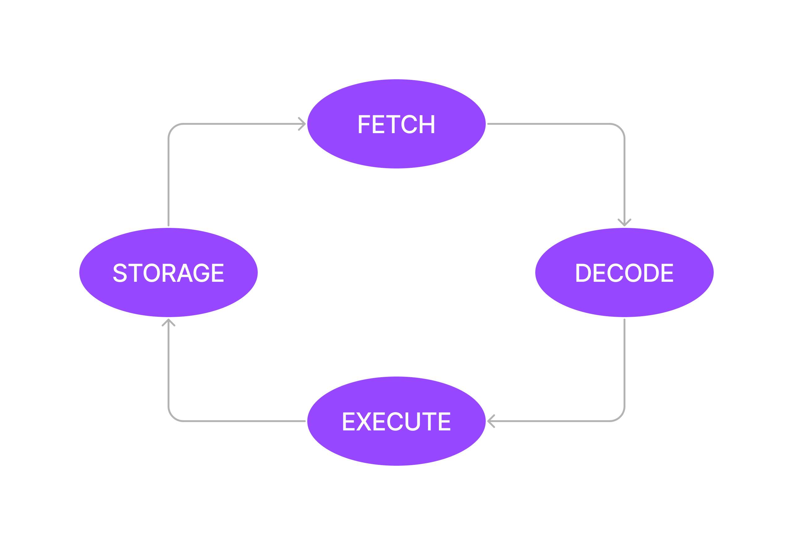
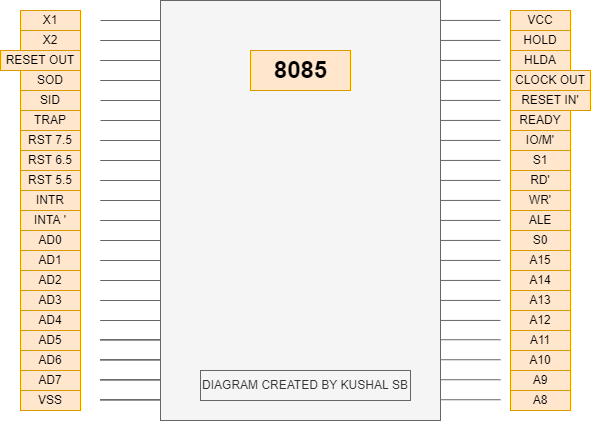
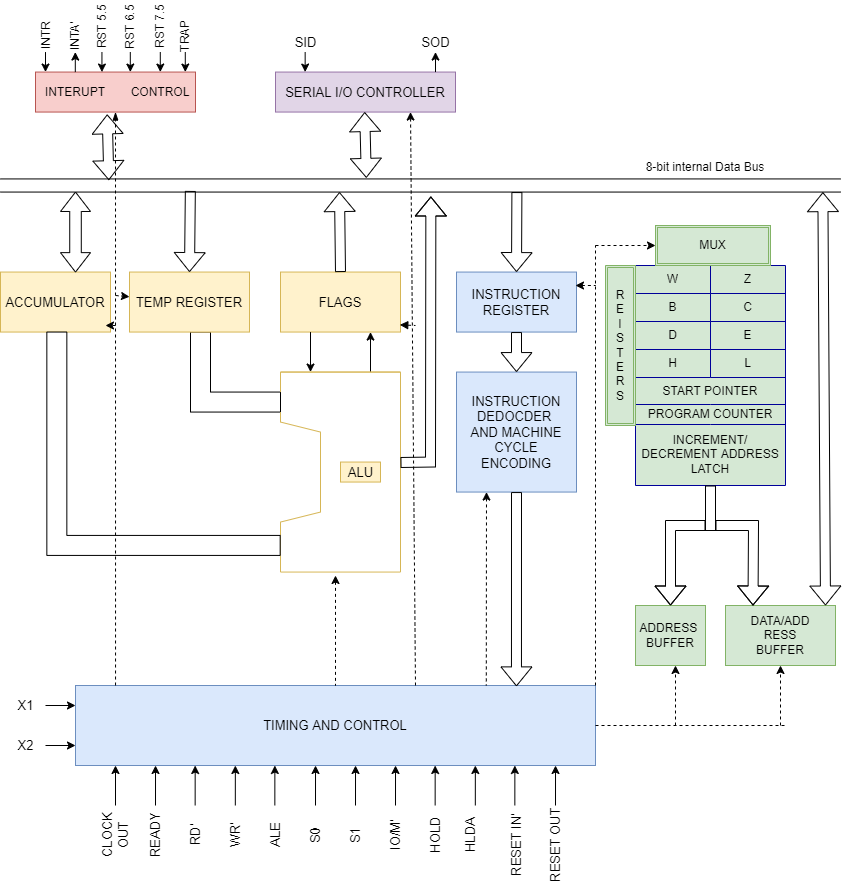

# MALP

# Microprocessor and Assembly Language Processing

# Quick Access

## - [Introduction to MicroProcessor](#introduction-to-microprocessor)

## - [8085 Microprocessor](#8085-microprocessor-1)

# Introduction to MicroProcessor

[Top](#quick-access)

# Table of Contents Chapter 1

### 1. [MicroProcessor](#microprocessor)

### 2. [MicroComputer](#microcomputer)

### 3. [MicroController](#microcontroller)

### 4. [Generation of Computer](#generations-of-computer)

### 5. [IC Fabrication Technology](#ic-fabrication-technology)

### 6. [History of Microprocessor](#history-of-microprocessor)

### 7. [I/O interfacing device](#io-interfacing-devices)

### 8. [Application of MicroProcessor](#application-of-microprocessor)

### 9. [Bus Structure of Microprocessor](#bus-organization--structure-of-a-microprocessor)

### 10. [Fetch Decode and Execute](#fetch-decode-execute-and-storage)

# MicroProcessor

- CPU of a digitial computer built into a single IC chip
  Introduction to Microprocessor:
- A MicroProcessor is a multipurpose, programmable, clock driven, register based electronic device that reads binary instructions from a storage device called memory, accepts binary data as input and processes data according to those instructions and provides result as output.
  

- The clock speed of a MP ranges from MHz to GHz.

# MicroComputer

: A computer having microprocessor as its CPU.

# MicroController

: Entire computer built into a single IC chip.

- The advancement in the development of Semiconductor device (IC's) led to the invention of microcontroller.

- A microcontroller is a semiconductor device which is fabricated to include MPU, memory, I/O and other peripherals (USB,etc) within the same IC-Package.

- Clock Speed is in the range of MHz

- It is used for specific purpose
  

# Generations of computer

<table border=1>
<tr><th>Generation</th><th>Main Features</th></tr>
<tr><td>1</td><td>Vacuum Tubes</td></tr>
<tr><td>2</td><td>Transitors</td></tr>
<tr><td>3</td><td>IC Chip/ LSI </td></tr>
<tr><td>4</td><td>MP/VLSI/ULSI </td></tr>
<tr><td>5</td><td>AI/Bio-chips </td></tr>
</table>

# IC Fabrication Technology

| IC   | Full Form               | No of gates/chips |
| ---- | ----------------------- | ----------------- |
| SSI  | Smale Scale Integration | Upto 10           |
| MSI  | Medium                  | 10-100            |
| LSI  | Large                   | 100-1000          |
| VLSI | Very Large              | 1000-100000       |
| ULSI | Ultra Large             | >100000           |

# History of Microprocessor

- First one is 4004 - 4 bit.
- 8008 - 8 bit.
- 8085 - 8 bit most popular.
- 8086 - 16 bit upgraded vesrion of 8085.
- 8088 - 16 bit first used in IBM computers.

- Currently using, Intel i7 11th Gen

# I/O Interfacing Devices

- Consider the block diagram of a computer system

- The input devices maybe Electro Mechanical in nature
- The output devices also maybe Electro Mechanical in Nature.

- But the CPU and Primary Memory are Electronic in nature.
- Thus we need some sort of interface to translate and the device we use for this are called input output interfacing device.

# Application of MicroProcessor

- Re-Programmable system, microprocessor is used as a computing unit.

- Embedded System, MP is part of the final product and is not available for end user. eg. Traffic light Control system.

Some of them are:

- Microcontroller
- Industrial Controls
- Robotics
- Medical Machine
- Washing Machine
- Traffic Light control system,etc

# Bus Organization / Structure of a MicroProcessor

- A bus is a path or group of wires thorough which data and information (bits) travels.
- It is an electronic path through which binary bits of data flow takes place.
- It consits of

1. Address Bus
   - Address bit travels
   - Addresss bit are fabricated such that its size in bit is a multiple of 4.
   - Total addressable memory for 'n' bits of Address bus is 2n.
   - unidirectional
2. Data Bus
   - that carries data
   - indicates the data bit capacity of a MP
   - Bidirectional
   - It may be 4-bit, 8-bit, 16-bit, 32-bit, 64-bit or 128-bit.
3. Control Bus
   - That carries control signals
   - The width of a bus depends upon the types of control signals used.
   - Control signals maybe memory read, memory write, I/O read, I/O write.

# Fetch Decode Execute and Storage

1. Fetch Operations

- In this operation instruction code and data from storage is loaded into the microprocessor.

2. Decode Operations

- Once the MPU gets the required data and instruction code, it uses the CU (Control Unit) to divide the information into a set of operations.

3. Execute Operations

- The operations divided by the CU are now executed by the ALU (Arithmetic and Logic Unit) and passed to the Storage(Memory).

4. Storage

- It stores data and/or instruction code.

# 8085 Microprocessor

[Top](#quick-access)

# Table of Contents Chapter 2

## 1. [Properties](#properties-of-8085)

## 2. [Pin Diagram](#pin-diagram-of-8085)

## 3. [Block Diagram](#block-diagram-of-8085)

## 4. [ALU](#alu)

## 5. [Register Array](#register-array)

## 6. [Timing and Control](#timing-and-control-unit)

## 7. [Instruction Register and Decoder](#instruction-register-and-decoder)

## 8. [Interrupt Control](#interrupt-control)

## 9. [Serial I/O Control](#serial-io-control)

## 10. [Data/Address Buffer](#data-and-addresss-buffer)

# Properties of 8085

- It is a 40 pin DIP (Dual Inline Package)
- Width of data bus: 8-bit
- Width of Address bus: 16-bit
- Total Addressable Memory: 216 - 65536 bytes or 64kB.
- It uses +5V power Supply
- Clock Frequency is 3MHz
- It has 74 basic instructions (extended upto 256)
- It generates 8-bit I/O address that can access i.e 28 : 256 I/O parts.

# Pin Diagram of 8085

1. X1 and X2 pin are for clock input which supplies a clock pulse of 3 MHz Frequency.
2. Reset Out pin resets pheripherals connected.
3. SOD - Serial Output Data
4. SID - Serial Input Data
5. TRAP - hiighest Priority Interrupt.
6. RST 7.5, RST 6.5, RST 5.5 and INTR are interrupts.
7. INTA' is Interrupt Acknoledgement.
8. AD0 to AD7 are multiplexed Address and Data pins
9. VSS is Ground.
10. A8 to A15 are Address pins
11. S0 and S1 are status pin
12. ALE is Address Latch Enable and is a Demulptiplexer pin for Address and Data Pins
13. WR' Writes to Memeoru
14. RD' Reads from Memory
15. IO/M' selects either input/output or storage
16. READY pin scans peripherals device
17. RESET IN' Resets the states internally.
18. CLOCK OUT outputs a pulse of 3Mhz
19. HOLD and HLDA are used for DMA (Direct Memory Access Operation)
20. VCC is input voltage of +5V.

# Block Diagram of 8085

The block Diagram of 8085 consists of following units:

1. Arithmetic and Logic Unit
2. Register Array
3. Timing and Control Unit
4. Instruction Register and Decoder
5. Interrupt Control
6. Serial I/O control
7. Data and Address Buffer

# ALU

- It is capable of performing arithmetic and logic operations
- It is associated with several register which are:

  1. Accumulator:
     - 8bit register
     - General purpose storage register
  2. Temporary Register:
     - 8 bit register
     - Gerneral purpose temporary register used to store data temporarily during the computation process.
  3. Flag Register: - It is a special type of register associated with ALU - Flags are flip flops used to indicate the operation inside ALU. - It shows the status of computation - There are 5 flags of 8085 microprocessor
     | D7 | D6 | D5 | D4 | D3 | D2 | D1 | D0
     | -- | -- | -- | -- | -- | -- | -- | --
     | S | Z |- | AC | - | P | - | CY

     - Sign Flag:
       - Arithmetic operation
       - If result negative then SF is set.
       - In case of signed number, it is set if D7 is 1. i.e number is a negative number.
     - Zero Flag
       - Arithmetic and Logic Operation
       - ZF is set if Result is zero
     - Auxillary Carry Flag
       - If carry occurs from D3 bit to D4 bit, it is set otherwise it is reset
       - It acts as borrow in case of Substraction.
     - Parity Flag
       - For Arithmetic and logic Operation
       - Set for Even Parity
     - Carry Flag
       - For Arithmetic operation
       - set if end carry exists in case of addition
       - set if borrow occurs in case of substraction

# Register Array

1. Temporary Register:
   - W and Z register used internally by the processor
2. General Purpose Register:
   - It consists of 8-bit register symboled as B,C,D,E,H and L.
   - These register can be combined in pair to store 16 bit data.
   - These register pair are BC , DE , HL
3. Stack Pointer (SP):
   - It is a 16 bit register used to hold the address of the stack
   - It points to the top of the Stack.
4. Program Counter (PC):
   - It is a 16 bit register that gives the address of the next instruction.
   - As soon as the instruction is fetched it is automatically incremented by 1.

# Timing and Control Unit

1.  This unit controls and coordinates all the activities ongoing inside the microprocessor system.
2.  It synchronizes all the operation with the clock and generates control signals necessary for communication between the microprocessor and peripherals.
3.  It includes various kind of signals like:
    > RD'  
    > WR' 
    > IO/ M'

# Instruction Register and Decoder

- An instruction register holds 8-bit instruction when it is fetched from memory.
- The decoder then decodes the instruction and establishes the sequence of event flow.

# Interrupt Control

- It handles all the hardware interrupt that comes from pin TRAP, RST 7.5, RST 6.5, RST 5.5 and INTR
- INTA is interrupt Acknowledge provided by this unit in response to the interrupt process.

# Serial I/O Control

- This Block is used for serial transmission of data. It consists two pins:
  1.  SID(Serial Input Data)
  2.  SOD (Serial Output Data)

# Data and Addresss Buffer

- The data/address buffer is used to store and forward the data/addresss in order to establish communication between microprocessor and peripherals
- DATA BUS is a tri-state Bi directional bus:

The Three states are:

1. High
2. Low
3. Disabled
